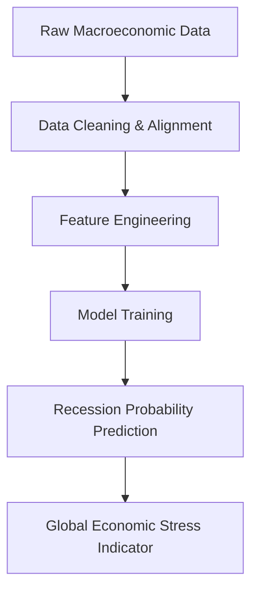
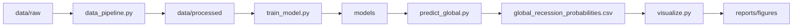
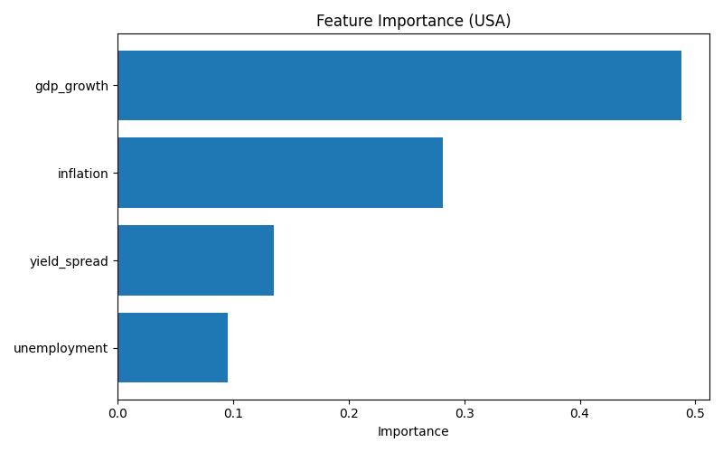

# Global Economic Stress Prediction (MLOps Project)

This project builds a **machine learning pipeline** to estimate **recession probability across major global economies** using macroeconomic indicators.

The system integrates:

- Data pipelines
- Feature engineering
- Machine learning models
- Global recession probability forecasting
- Visualization of economic stress indicators

Countries modeled:

- United States
- United Kingdom
- India
- Japan
- Germany

---

# Project Objective

The goal of this project is to model **global economic stress** by predicting recession probability using macroeconomic indicators commonly used by economists and central banks.

Indicators used:

- GDP Growth
- Inflation
- Unemployment
- Yield Curve Spread (10Y − 3M)

Yield curve inversion has historically been one of the **strongest predictors of recessions**.

---

# Data Sources

Macroeconomic datasets were collected from:
- FRED (Federal Reserve Economic Data)
- OCED economic datasets
- National statistical agencies

These datasets include GDP growth, inflation, unemployment rates, and interest rate data used for macroeconomic modeling.

---

# Machine Learning Pipeline

This pipeline:

- Loads macroeconomic data for each country
- Cleans and aligns time series data
- Engineers macroeconomic features
- Trains machine learning models
- Generates global recession probability indicators

---

# Project Architecture

The architecture shows how the ML pipeline processes data and produces global economic insights.

---

# Project Structure

global-economic-stress-mlops
│
├── data
│   ├── raw
│   │   ├── usa
│   │   ├── uk
│   │   ├── india
│   │   ├── japan
│   │   └── germany
│   │
│   ├── processed
│   │   ├── usa_macro_quarterly.csv
│   │   ├── uk_macro_quarterly.csv
│   │   ├── india_macro_quarterly.csv
│   │   ├── japan_macro_quarterly.csv
│   │   └── germany_macro_quarterly.csv
│   │
│   └── global_recession_probabilities.csv
│
├── models
│   ├── logistic_model_usa.pkl
│   ├── logistic_model_uk.pkl
│   ├── logistic_model_india.pkl
│   ├── logistic_model_japan.pkl
│   └── logistic_model_germany.pkl
│
├── reports
│   └── figures
│       └── recession_probabilities.png
│
├── src
│   ├── data_pipeline.py
│   ├── train_model.py
│   ├── predict_global.py
│   └── visualize.py
│
├── main.py
└── README.md

---

# Data Pipeline

Each country dataset contains:
- GDP growth
- Inflation
- Unemployment
- Short-term interest rates (3M)
- Long-term interest rates (10Y)
- Recession indicator

The pipeline performs:
- Data cleaning
- Date alignment
- Quarterly conversion
- Yield curve spread calculation
- Dataset merging

Processed datasets are stored in:

data/processed/

---

# Feature Engineering

The model uses the following macroeconomic predictors:

|  **Feature** |          **Description**         |
|:------------:|:--------------------------------:|
| GDP Growth   | Measures economic expansion      |
| Inflation    | Price level change               |
| Unemployment | Labor market weaknesses          |
| Yield Spread | Long-term rate − short-term rate |

Yield curve inversion is widely used by economists to forecast recessions.

---

# Machine Learning Models

Two machine learning models are used to predict recession probability:
- Logistic Regression
- Random Forest Classifier

Logistic Regression provides interpretable baseline results, while Random Forest captures non-linear relationships between macroeconomic indicators.

Both models are trained and evaluated for each country.

---

# Model Evaluation

Evaluation metrics include:
- ROC-AUC Score
- Precision
- Recall
- F1 Score
- Classification Report

Example results:

| **Country** |            **Logistic ROC**           | **Random Forest ROC** |
|:-----------:|:-------------------------------------:|:---------------------:|
| USA         | 0.96                                  | 0.96                  |
| UK          | 0.90                                  | 0.83                  |
| India       | N/A (no recession events in test set) | N/A                   |
| Japan       | 0.92                                  | 0.62                  |
| Germany     | 0.49                                  | 0.33                  |

---

# Global Recession Probability Output

After training models, the system generates:

data/global_recession_probabilities.csv

Example:

| **Date** | **USA** | **UK** | **India** | **Japan** | **Germany** |
|:--------:|:-------:|:------:|:---------:|:---------:|:-----------:|
|  2022-Q1 |   0.12  |  0.15  |    0.09   |    0.11   |     0.13    |
|  2022-Q2 |   0.18  |  0.21  |    0.11   |    0.16   |     0.19    |

This represents a **Global Economic Stress Indicator**.

---

# Visualization

The pipeline automatically generates recession probability charts.

# Feature Importance

Random Forest models are used to estimate the importance of macroeconomic indicators in predicting recessions.

Example feature importance output:

This analysis highlights which macroeconomic variables contribute most strongly to recession prediction.

# Global Recession Probability

The chart visualizes recession risk across major economies over time.

---

# How to Run the Project

Clone the repository:

git clone <your_repo_url>
cd global-economic-stress-mlops

Create virtual environment:

python3 -m venv venv
source venv/bin/activate

Install dependencies:

pip install pandas numpy scikit-learn matplotlib

Run the pipeline:

python3 main.py

The script will:
- Process macroeconomic datasets
- Train machine learning models
- Generate recession probability forecasts
- Create visualizations

---

# Tech Stack

Languages and tools used:
- Python
- Pandas
- NumPy
- Scikit-learn
- Matplotlib

Machine Learning Models:
- Logistic Regression
- Random Forest 

Concepts applied:
- Macroeconomic indicator modeling
- Time-series feature engineering
- Recession prediction
- Feature importance analysis
- Data pipeline automation

---

# Exploratory Data Analysis

Exploratory data analysis was performed to understand macroeconomic indicator trends and their relationship with recession periods.

See the notebook:

'notebooks/exploratory_analysis.ipynb'

# Future Improvements

Potential enhancements include:
- Automated macroeconomic data ingestion using APIs
- Additional indicators (credit spreads, PMI, market volatility)
- Gradient boosting models
- Global economic dashboard
- Automated ML pipelines (MLOps)
- Model monitoring and retraining

---

# Author

Chelsea Patel

Engineering student focused on **Data Science, Machine Learning, and Economic Analytics**.

---